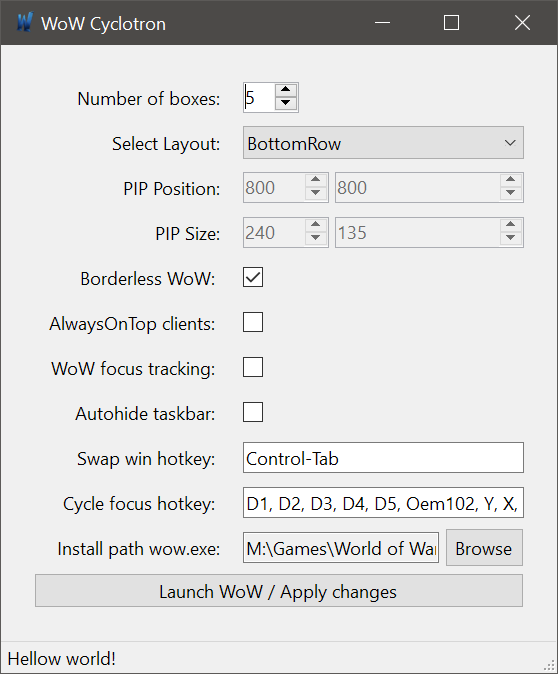

# WoW Cyclotron

[Download](https://github.com/DejayRezme/WoWCyclotron/releases)

A simple utility to launch multiple World of Warcraft instances and position them on your desktop in different layouts, including the ability to set the windows to borderless and alwaysOnTop, and a hotkey to switch which window is being shown as the big "maximized" main window.

This supports cycling focus to different wow windows with multiple hotkeys.

This software does NOT send or allow to send any input to World of Warcraft! It should be fully compliant with the new rules for multiboxing in WoW.

The software is supplied "as is" under MIT license, no liability, see license file for details.

## Installation

You can download the app [from the releases here](https://github.com/DejayRezme/WoWCyclotron/releases). The easiest way to get going is to download the 25mb large [WoWCyclotron.Standalone.zip](https://github.com/DejayRezme/WoWCyclotron/releases/download/9.0.3/WoWCyclotron.Standalone.zip). You don't need to install .net 5 to run the exe inside the larger zip file. 

If you want you can also use the smaller 100kb [WoWCyclotron.zip](https://github.com/DejayRezme/WoWCyclotron/releases/download/9.0.3/WoWCyclotron.zip) but you need to install [.net 5.0 runtime](https://dotnet.microsoft.com/download/dotnet/current/runtime) to run it.

Put the exe anywhere you want, start it and make sure the install path is set (select \_retail\_ folder containing your wow.exe for retail or \_classic\_ folder containing wowClassic.exe for classic). Try out the different options and check the features section below for an idea of what they do.

## Features

* Number of boxes: allows you to set up many wow windows can be started. Currently restricted to 10

* Select Layout: Best to try them out. The screen is subdivided into 3x3 or 4x4 grid and the main window is being put in the top left portion of the grid while the smaller windows are arranged in one line (SingleRow) or in an L-Shape around the main window (LShape). These otpions keep the aspect ration and leaves a bit of space for a small youtube window in the corner.

* You can also use SingleRowFill which changes the aspect ration to a bit more ultra-wide (20:9) and fills the entire screen.

* Install path: Set the install path to your "\_retail\_" directory containing the wow.exe first. I haven't tested if it works for classic, let me know.

* Launch WoW / Apply Changes: This launches the wow instances or updates their window position if you changed the layout or pip position or borderless / always on top state. So you can press this button repeatedly, it will only launch / update previously launched wow windows as needed

* Borderless WoW: Removes the caption and border from the wow window for less clutter. 

* AlwaysOnTop clients: Makes only the smaller windows or PIP windows always on top.

* Enable focus tracking: This enables the custom x-mouse focus style tracking. Unlike WoWStarter this doesn't use the windows build in functionality but only works on the wow windows. So if you press hotkeys they cycle, but after a very short timeout the window that your mouse targets is focused instead. This allows you to combine hotkey driven focus cycling with easy switching to smaller windows with your mouse.

* Enable hide taskbar: This sets the windows taskbar to autohide. This is useful if you don't want the taskbar to be above your smaller wow windows. Applied immediately once wow is running. 

* Swap win hotkey: This enables a hotkey that will allow you to click on one of the smaller wow windows and switch it to the bigger window. Useful for configuring alts. Together with mouse over focus tracking you can hover over a small pip and press Ctrl+Tab to maximize, and press it again to switch back. If you press it when the maximized window is in focus then it will cycle through all wow windows.

  For non US keyboards (ISO) I suggest to add Oem5 to this

  Cycle focus hotkey: You can add the keys you want. If you press a key set here, it will be read normally from your wow client. The app also listens to the same key and cycles the focus to your next wow window. Unfortunately modifier keys like "Alt-1" don't work too well for this. They work but you have to press and release the modifier for each window. Since we don't send keys, the next wow window won't see the modifier key being pressed and just see the key without the modifier.

  This only happens when you have a wow window in the foreground and have Scroll-Lock enabled!

## Notes

* The utility saves a config file called WoWCyclotron.json next to the exe, so make sure to have write permission
* Optionally you can have multiple "config.wtf" file named config1.wtf and config2.wtf etc. Simply copy and rename them in your WTF folder. If those files exist the launcher will use that file by passing it as a command line ("wow.exe -config config1.wtf"). This is useful to have the correct account preselected for each box (e.g. wow1) or have different graphics and sound settings on each box.
* Optionally you can have multiple "\_retail\_" folders set in installPaths in the WoWStarter.json config file. This was requested to have different addons configurations in separate paths. If more boxes are launched than install paths are defined then the last will be used. Folder select button will override multiple install paths set. I don't support this option but it should work if you really need it.

## Todo

* TODO: Hotkey to temporarily hide the alwaysOnTop PIPs (or maybe automatically when wow is not in foreground?)
* TODO: Hotkey to disable / enable X-Mouse functionality

---

## License

MIT License

Copyright (c) 2020 Dejay Rezme

Permission is hereby granted, free of charge, to any person obtaining a copy
of this software and associated documentation files (the "Software"), to deal
in the Software without restriction, including without limitation the rights
to use, copy, modify, merge, publish, distribute, sublicense, and/or sell
copies of the Software, and to permit persons to whom the Software is
furnished to do so, subject to the following conditions:

The above copyright notice and this permission notice shall be included in all
copies or substantial portions of the Software.

THE SOFTWARE IS PROVIDED "AS IS", WITHOUT WARRANTY OF ANY KIND, EXPRESS OR
IMPLIED, INCLUDING BUT NOT LIMITED TO THE WARRANTIES OF MERCHANTABILITY,
FITNESS FOR A PARTICULAR PURPOSE AND NONINFRINGEMENT. IN NO EVENT SHALL THE
AUTHORS OR COPYRIGHT HOLDERS BE LIABLE FOR ANY CLAIM, DAMAGES OR OTHER
LIABILITY, WHETHER IN AN ACTION OF CONTRACT, TORT OR OTHERWISE, ARISING FROM,
OUT OF OR IN CONNECTION WITH THE SOFTWARE OR THE USE OR OTHER DEALINGS IN THE
SOFTWARE.